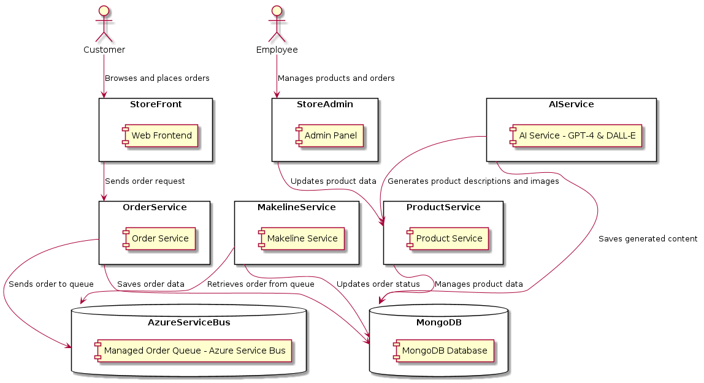

# Lab Project Assignment #2: Building a Cloud-Native App for Best Buy

### Student Id: 041109491
### Name: Bhupinder Singh

## Project Overview
This submission is for Lab Project Assignment #2, where the task was to develop a cloud-native application for Best Buy. The application adheres to the design principles of "Algonquin Pet Store (On Steroids)" but introduces key changes such as:

- Replacing RabbitMQ with a managed order queue service (Azure Service Bus).
- Integrating AI features for generating product descriptions and images.
- Deploying the application on Kubernetes with scalable and reliable microservices.

## Application Architecture
### Components:
1. **Store-Front**: Customer-facing application for browsing products and placing orders.
2. **Store-Admin**: Employee-facing application for managing products and orders.
3. **Order-Service**: Processes orders and integrates with Azure Service Bus for messaging.
4. **Product-Service**: Handles CRUD operations for product management.
5. **Makeline-Service**: Completes orders by consuming messages from the order queue.
6. **AI-Service**: Uses GPT-4 and DALL-E for generating product descriptions and images.
7. **Database**: MongoDB for storing product and order data.

### Updated Architecture Diagram

This is a demo cloud-native application for Best Buy's online store.

### Updated Architecture Diagram

---

## Microservices Development
- Forked the Algonquin Pet Store repositories as a base template.
- Enhanced each microservice to support the new requirements, such as Azure Service Bus integration and AI-powered functionalities.
- Developed additional APIs for seamless communication between services.

---

## Kubernetes Deployment
### Key Deployment Features:
1. **StatefulSet for MongoDB**:
   - Ensures data persistence with reliable storage.

2. **ConfigMaps and Secrets**:
   - Used for managing non-sensitive configurations and storing credentials securely.

3. **Scalability and Availability**:
   - Autoscaling enabled for high-demand services.
   - Liveness and readiness probes implemented for health checks.

### Deployment Files
| Service          | Deployment File Link                                                                                                                                  |
|------------------|-------------------------------------------------------------------------------------------------------------------------------------------------------|
| Store-Front      | [Store-Front Deployment File](https://github.com/bhupinder2414/Best-Buy-Deployment-Files/blob/main/Deployment%20for%20Store%20Front.yaml)             |
| Store-Admin      | [Store-Admin-Deployment File](https://github.com/bhupinder2414/Best-Buy-Deployment-Files/blob/main/Deployment%20for%20Store%20Admin.yaml)             |
| Order-Service    | [Order-Service-Deployment File](https://github.com/bhupinder2414/Best-Buy-Deployment-Files/blob/main/Deployment%20for%20Order%20Service.yaml)         |
| Product-Service  | [Product-Service-Deployment File](https://github.com/bhupinder2414/Best-Buy-Deployment-Files/blob/main/Deployment%20for%20Product%20Service.yaml)     |
| Makeline-Service | [Makeline-Service-Deployment File](https://github.com/bhupinder2414/Best-Buy-Deployment-Files/blob/main/Deployment%20for%20Makeline%20Service.yaml)   |
| AI-Service       | [AI-Service-Deployment File](https://github.com/bhupinder2414/Best-Buy-Deployment-Files/blob/main/Deployment%20for%20AI%20Service.yaml)               |
| MongoDB          | [MongoDB-Deployment File](https://github.com/bhupinder2414/Best-Buy-Deployment-Files/blob/main/MongoDB-StatefulSet.yaml)                              |
| Virtual-Worker   | [Virtual-Worker -Deployment File](https://github.com/bhupinder2414/Best-Buy-Deployment-Files/blob/main/Deployment%20for%20virtual-worker.yaml)        |
| Virtual-Customer | [Virtual-Customer Deployment File](https://github.com/bhupinder2414/Best-Buy-Deployment-Files/blob/main/Deployment%20for%20virtual-customer.yaml)     |
| RabbitMQ         | [RabbitMQ Deployment File](https://github.com/bhupinder2414/Best-Buy-Deployment-Files/blob/main/RabbitMQ-StatefulSet.yaml)                            |

---

## Docker Images
| Service          | Docker Image Link                                                                                                   |
|------------------|---------------------------------------------------------------------------------------------------------------------|
| Store-Front      | [Store-Front Image](https://hub.docker.com/repository/docker/bhup0006/bhup0006-store-front/general)                 |
| Store-Admin      | [Store-Admin Image](https://hub.docker.com/repository/docker/bhup0006/bhup0006-store-admin/general)                 |
| Order-Service    | [Order-Service Image](https://hub.docker.com/repository/docker/bhup0006/bhup0006-order-service/general)             |
| Product-Service  | [Product-Service Image](https://hub.docker.com/repository/docker/bhup0006/bhup0006-product-service/general)         |
| Makeline-Service | [Makeline-Service Image](https://hub.docker.com/repository/docker/bhup0006/bhup0006-makeline-service/general)       |
| AI-Service       | [AI-Service Image](https://hub.docker.com/repository/docker/bhup0006/bhup0006-ai-service/general)                   |
| Virtual-Worker   | [Virtual-Worker Image](https://hub.docker.com/repository/docker/bhup0006/bhup006-virtual-worker/general)            |
| Virtual-Customer | [Virtual-Customer Image](https://hub.docker.com/repository/docker/bhup0006/bhup0006-virtual-customer/general)       |

---

## Demo Video
[Link to Demo Video](https://algonquinlivecom-my.sharepoint.com/:v:/g/personal/bhup0006_algonquinlive_com/EfAHVmeGG-5Eta9xegsxEIcBmzemKnH7PQyejtrpfqdSSA?nav=eyJyZWZlcnJhbEluZm8iOnsicmVmZXJyYWxBcHAiOiJPbmVEcml2ZUZvckJ1c2luZXNzIiwicmVmZXJyYWxBcHBQbGF0Zm9ybSI6IldlYiIsInJlZmVycmFsTW9kZSI6InZpZXciLCJyZWZlcnJhbFZpZXciOiJNeUZpbGVzTGlua0NvcHkifX0&e=c54qmy)

### Highlights:
1. Application functionality demonstration.
2. AI-generated product descriptions and images.
3. Azure Service Bus integration for order processing.

---

## Challenges Faced

During the development and deployment of the Best Buy Cloud-Native Application, several challenges were encountered. These included technical, architectural, and deployment-related issues. Below are the key challenges faced:

1. **AI Integration (GPT-4 and DALL-E)**:
During the deployment of the AI-Service, I encountered a CrashLoopBackOff error, which means that the container started but failed repeatedly, causing Kubernetes to try and restart it multiple times. This typically happens when there is a failure in the container during its startup or runtime. Below are the specific troubleshooting steps and changes made to resolve the issue:

   - Step 1: Check Logs for Error Details
First I examined the logs of the pod to understand why the AI-Service was failing. The logs indicated that the service was having trouble connecting to the Azure OpenAI API due to a misconfiguration in the API key and endpoint environment variables.

    - Step 2: After fixing the environment variables, I noticed that the AI-Service was still not able to start reliably, even with the correct API configuration. This was likely due to resource constraints. The AI-Service required significant CPU and memory resources due to the computational intensity of GPT-4 and DALL-E model calls.
      
    - Step 3: Finally, I reviewed whether any external dependencies, such as the Azure OpenAI endpoint or related services, were unavailable or experiencing intermittent issues. I observed some network-related delays during high-demand periods that were causing timeouts for the AI-Service.

2. **Kubernetes Deployment**:
   - Issue: Deploying multiple microservices to Kubernetes required careful configuration of Kubernetes resources, including Pods, Deployments, Services, ConfigMaps, and Secrets. Additionally, StatefulSets for MongoDB posed difficulties due to persistent volume provisioning.

3. **CI/CD Pipeline Setup**:
   - Setting up the CI/CD pipeline for each microservice was time-consuming due to configuring the build, test, and deployment steps for multiple services.
   - Overcame with the using GitHub Actions workflows.

---

## Issues and Limitations
- High computational demand for AI-Service under heavy loads.
- Limited testing with real-world traffic scenarios.

---

## Bonus Task: CI/CD Pipeline
- Implemented CI/CD pipelines for all microservices using GitHub Actions.
- Automated building, testing, and deploying processes for rapid iteration.

### GitHub Repository Links
| Service          | Repository Link                                                             |
|------------------|-----------------------------------------------------------------------------|
| Store-Front      | [Store-Front Repo](https://github.com/bhupinder2414/store-front)            |
| Store-Admin      | [Store-Admin Repo](https://github.com/bhupinder2414/store-admin)            |
| Order-Service    | [Order-Service Repo](https://github.com/bhupinder2414/order-service)        |
| Product-Service  | [Product-Service Repo](https://github.com/bhupinder2414/product-service)    |
| Makeline-Service | [Makeline-Service Repo](https://github.com/bhupinder2414/makeline-service)  |
| AI-Service       | [AI-Service Repo](https://github.com/bhupinder2414/ai-service)              |
| Virtual-Worker   | [Virtual-Worker Repo](https://github.com/bhupinder2414/virtual-customer)    |
| Virtual-Customer | [Virtual-Customer Repo](https://github.com/bhupinder2414/virtual-customer)  |

---

Thank you for reviewing my submission. I am happy to provide additional details or address any questions!
